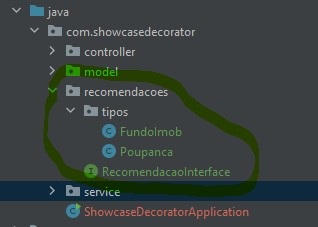

# showcase-decorator-patterns

 
Decorator é um pattern que tem como base que você possa distribuir metodos genéricos ou que   
possam ser usados emmais classes mais facilmente.
 

Seu principal uso é em formas de pagamento, ou em quaisquer objetos que precisem ter uma funcionalidade  
coringa que precisem ter tipos diferentes de processamentos em casos diferentes, mesmo sendo do mesmo tipo.
</b>
 
 

No exemplo deste projeto é mostrado como exemplo recomendação de investimentos.
Caso valor da compra de um produto for maior que 100 retorna um tipo de resposta.  
Senão outra.  

Se quiser subir aplicação e testar fique a vontade.  
O curl segue abaixo.  
Ela foi feita em java11  
 
``
curl --location --request POST 'http://localhost:8080/recomendar' \
--header 'Content-Type: application/json' \
--data-raw '{
"nomeProduto":"teste",
"valorCompra":"1000"
}'
``

Você pode observar abaixo na sequencia a amostra do codigo.  

Estrutura :  
  
 
Metodos:  
  
 
Chamada:  
  

